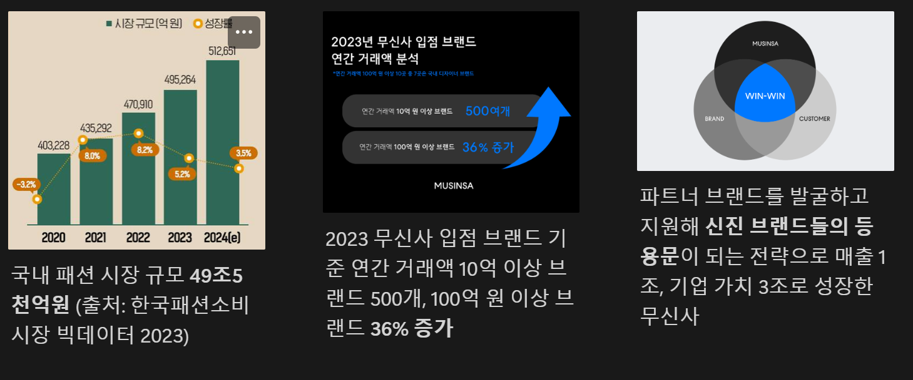
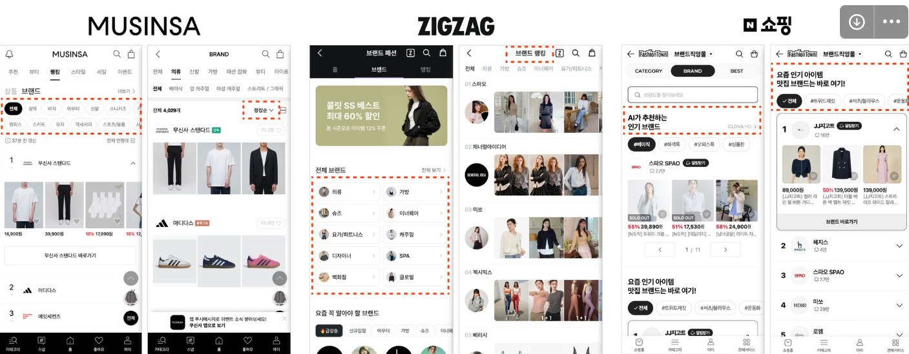
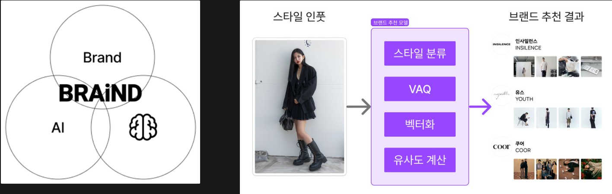
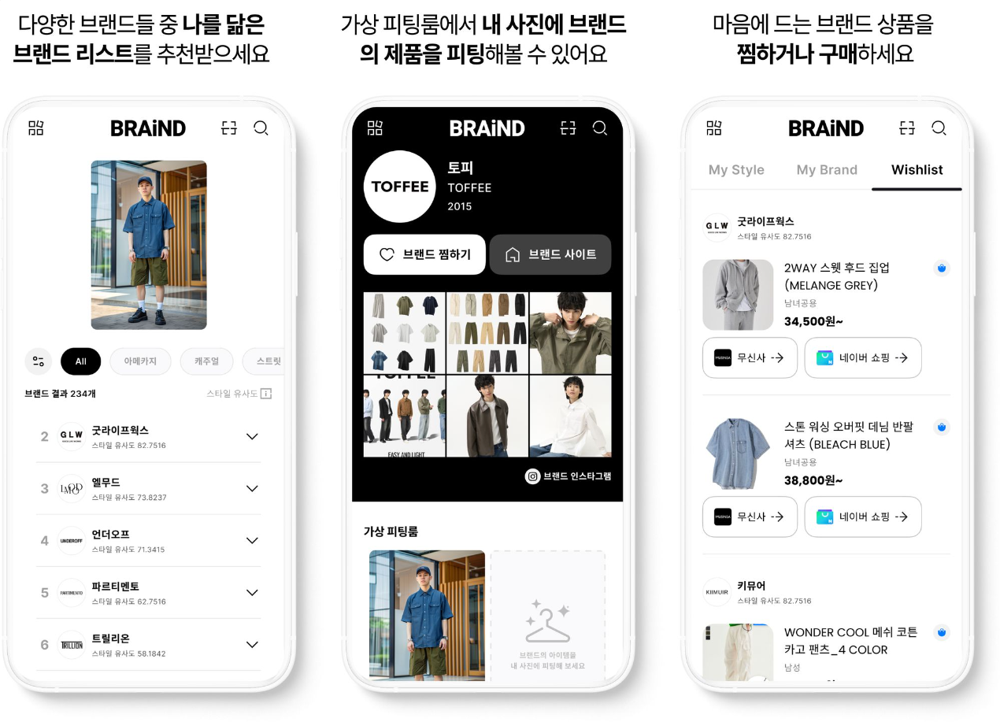
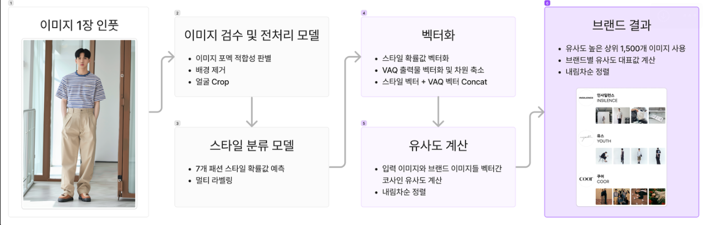
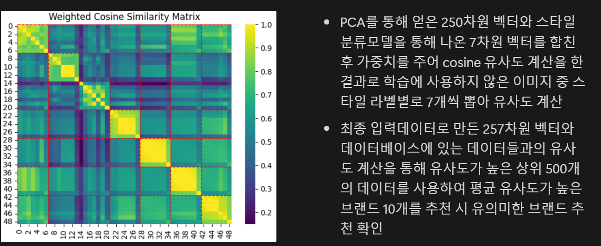

# 최종 프로젝트

## 나를 닮은 브랜드를 찾아주는 Ai <BRAIND>

## 기획 의도
- <aside>
💡 **AI 기술로 패션 브랜드들의 성장을 지원**

한국에 역량 있는 신진, 스몰 패션 브랜드들이 많지만 그에 비해 **고객에게** **발견되는 방식**은 제한적이고 어렵습니다.

브래인드는 AI 기술을 활용해 패션 브랜드들이 1)**적합한 고객에게 추천되고** 2)**임팩트 있는 브랜드 경험**을 만들 수 있는 새로운 방식을 제안하는 프로젝트 입니다.

</aside>

1. 성장중인 한국 패션 시장과 도메스틱 브랜드

2. 랭킹, 카테고리, 이름 검색이 전부인 '브랜드 탐색'

3. 신진, 스몰 브랜드들의 성장을 돕는 AI

4. 주요 기능

## 진행 경과
- 사용한 모델 수 : 20
- 학습한 이미지 데이터 수 : 288,854
- 개발한APi 개수 : 21

## 기술 스택
- 언어: Python, VS Code, GitHub, FileZilla
- ML 개발: Pytorch, Google Colab, Selenium, RMBG-1.4, Deface, Regnet, Swin transformer, Lavis BLIP, OOTDiffusion, YOLOv8, Scikit-Lear
- 서비스 개발: Figma, React, Node.js
- 기획 및 PM: Figjam, Notion, Upbase, Google Drive, Slack, Office 365

## 브랜드 추천 모델 파이프 라인
- 데이터 수집 및 전처리 : 브랜드별 스냅 이미지 약 3만장 수지 후 이미지에서 배경 및 모델 얼굴 제거
- 스타일 분류 : shuffleNet 기반, 이미지를 7개 스타일로 라벨링하여 학습
- VQA(Visual Question Answering) : 이미지만을 통한 특성 추출의 한계를 보완하기 위해 Multi model 기법 활용

## 플로우 차트

## 모델 개발 과정

### 패션 브랜드별 스타일 학습하기 위한 데이터 수집

- 브랜드가 라벨링 되어 있는 전신 코디 이미지 데이터 약 25만장 수집

- 브랜드 기본 정보와 브랜드에서 판매중인 제품 이미지 및 메타 데이터 약 30만개 수집

### 브랜드와 코디 이미지의 유사도를 계산하기 위해 이미지 벡터화

스타일 분류 결과 7개 스타일 각 라벨 별 예측 확률값을 벡터화하고 VQA로 나온 10개의 단어들을 토크나이저로 임베딩

25차원으로 줄이면 데이터의 분산이 95%가 유지되는 것을 확인하였고 연산량 줄이기 위해 PCA를 통해 96차원 벡터를 25차원으로 차원축소

스타일 벡터와 VQA 벡터를 Concat 결합. 사용자 입력 이미지와 DB에 저장된 이미지들의 벡터들 사이의 Cosine 유사도 계산 및 내림차순 정렬해 상위 브랜드 출력

## 성능 평가

